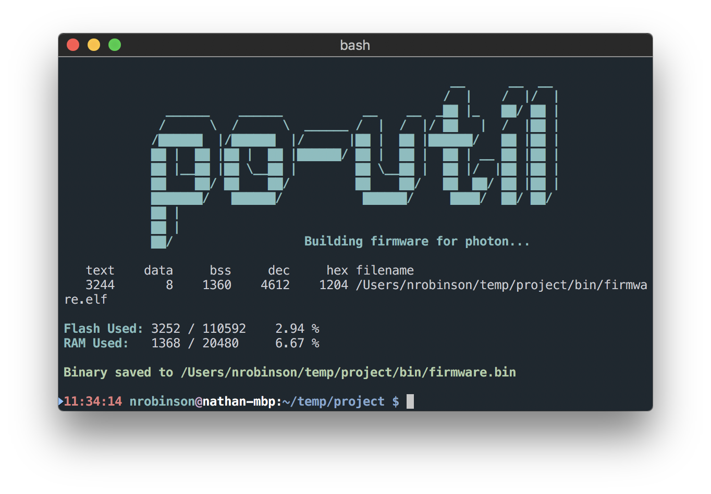

> **The Particle Web IDE, Particle Dev, and particle-cli are not the only ways to program Particle devices - by [Nathan Robinson](https://nrobinson2000.me)**

<p align="center">

</p>

## What is po-util?

[Po-util](https://github.com/nrobinson2000/po-util), short for Particle Offline Utility, is a tool I maintain for facilitating the ultimate local Particle development experience. Po-util installs the tools Particle's servers use to build firmware in the cloud onto your computer and provides simple commands to use these tools on your computer.

Po-util is unique from the development solutions like the [Web IDE](https://www.particle.io/products/development-tools/particle-web-ide), [Particle Dev](https://www.particle.io/products/development-tools/particle-desktop-ide), and [particle-cli](https://www.particle.io/products/development-tools/particle-command-line-interface) that Particle provides because it is independent of the Particle cloud and it can build your firmware offline. Po-util primarily uses DFU to transfer firmware to a device over USB rather than upload firmware "Over The Air", which is slower and less reliable than a direct connection.

Po-util is my personal solution to local Particle development and I use it exclusively when developing on Particle devices. I hope that you will find it beneficial to your Particle workflow.

Po-util is written in Bash and is available on GitHub for [Linux](https://github.com/nrobinson2000/po-util) and [macOS](https://github.com/nrobinson2000/homebrew-po). I have licensed it under the [GNU General Public License](https://www.gnu.org/licenses/gpl-3.0.en.html). Contributions and donations are welcome.

## Features of po-util

There are many more features to po-util than aliasing a few `make` commands.  Po-util is a unique workflow I meticulously developed so that others can experience local Particle development the way it was meant to be.

#### Po-util offers many features, including:

* Full installation of required dependencies like the ARM toolchain, DFU Utilities, and the Particle Firmware.

* Support for building firmware for the Particle Photon, Electron, P1, Core, Raspberry Pi, and Redbear Duo.

* "Instant" firmware uploading over USB using DFU Utilities.

* Sequential "Over The Air" firmware uploading to multiple devices in a "product".

* A unified project structure that is cross-compatible between Linux and macOS editions.

* An efficient library manager that works with libraries from Particle Libraries 2.0 and GitHub.

* A range of keyboard shortcuts to expedite development within [Atom](https://atom.io).

## Getting started with po-util

Installing and using po-util is a rewarding experience.  (You must be an administrator on your computer however.)

Run the following in your Terminal to install po-util:

```bash
$ bash <(curl -sL get.po-util.com)
```

You will be prompted with the following. Press ENTER to confirm.

```bash
Are you ready to install po-util?

Please be sure to follow any prompts or instructions
during the installation process.
ENTER / CTRL-C:
```

You will asked to configure po-util during the installation process. I suggest you respond with `release/stable`, `duo`, and `yes` when prompted.

## Creating a project with po-util

To use po-util, you must work in an initialized project directory. (More on project structure below.)

To create a project simply run the following in your Terminal:

```bash
$ po photon init newProject
```

This command creates the `newProject` folder and creates the appropriate folders and files inside.  The [Atom](https://atom.io) shortcuts file is set to build firmware for the Particle Photon. (You can substitute `photon` with `electron`, `P1`, `core`, `pi`, or `duo` to initialize the project for other devices.)

To make use of the shortcuts you will need the [Atom Build package](https://atom.io/packages/build).  You can easily install the package and a couple of other recommended ones with:

```bash
$ po setup-atom
```

>If you get an error, open Atom and select `Install Shell Commands` from the menu.

## Po-util project structure

Po-util operates by keeping your code in organized projects that follow the following structure:

```bash
firmware/
└ main.cpp

bin/
└ firmware.bin

devices.txt
libs.txt
.atom-build.yml
README.md
```

All source code goes in `firmware/`, and the firmware is compiled as `bin/firmware.bin`. You can specify devices to flash sequentially to in `devices.txt`, and what libraries to use in `libs.txt`.

Po-util supports build shortcuts for [Atom](https://atom.io), and these are set in `.atom-build.yml` should you need to modify it on a per-project basis.

## Using po-util with Atom

Now that you have created a project and installed the recommended packages, open the project folder in Atom.

On the left, you should find your `firmware/main.cpp` file.  This is where you should keep most of your code.  (You can use separate files and libraries however, but the majority of your code should be kept here.)

When your project is initialized, you will find the following dummy code in your `firmware/main.cpp`:

```cpp
#include "Particle.h"

void setup() { // Put setup code here to run once

}

void loop() { // Put code here to loop forever

}
```

Here is where you can observe one of the most useful features of po-util, the keyboard shortcuts for Atom.  If you press `CTRL-ALT-1`, Atom will build the project by running:

```bash
$ po photon build
```

Pressing `CTRL-ALT-2` builds the firmware and flashes it to your device over USB using DFU Utilities by running the following, which can also be done from your Terminal:

```bash
$ po photon flash
```

Pressing `CTRL-ALT-3` cleans the firmware and removes the `bin/` directory by running:

```bash
$ po photon clean
```

Pressing `CTRL-ALT-4` uploads firmware to your device without rebuilding by running:

```bash
$ po photon dfu
```

Pressing `CTRL-ALT-5` uploads your firmware "Over The Air" to any devices listed in your `devices.txt` by running:

```bash
$ po photon ota --multi
```

## Using Particle libraries with po-util

One of the greatest features of po-util is its flexible library manager.  The library manager not only allows using libraries from Particle's list of libraries, but it also supports using any library that is available from GitHub.

A library can be downloaded and added to a project by using the `$ po lib get` and `$ po lib add` commands. For example, you could add the `neopixel` library to a project with the following commands:

```bash
$ po lib get neopixel
$ po lib add neopixel
```

You could go even further and load an example from the `neopixel` library.

First, check what examples are available with:

```bash
$ po lib ex ls neopixel
```

The command above returns the following, indicating there are examples available:

```bash
Found the following neopixel examples:

a-rainbow, extra-examples, rgbw-strandtest
```

To load the `extra-examples` example into your project run:

```bash
$ po lib ex load neopixel extra-examples
```

## Sharing a po-util project

The most practical way to share a po-util project is to upload it to GitHub, as your project is initialized as a git repository and set up to use [Travis CI](https://travis-ci.org/) for testing.

Po-util provides another method if you want a "quick and dirty" way to share your code so that it can be built without using po-util. Using `$ po lib pack`, you can create a copy of your `firmware/` directory with all symbolic links and libraries packaged inside.  A .zip archive is created as well.

When using publicly accessible libraries it is advised that you clean the binaries and libraries from your project.  This removes the symbolic links from your `firmware` directory, but leaves the libraries your project depends on in your `libs.txt`.

To clean your project run the following:

```bash
$ po lib clean
```

At any time, you can re-download and add the libraries using:

```bash
$ po lib setup
```

> **If you are sharing using GitHub and Travis CI, cleaning is not necessary, as Travis CI will do it for you when building your project.**

<p align="center">

</p>

## More po-util information

For more information about po-util, read the man page with `$ man po`, [check out the website](https://nrobinson2000.github.io/po-util/), [consult the repository on GitHub](https://github.com/nrobinson2000/po-util), [join the Gitter room](https://po-util.com/gitter), [view the Trello](https://po-util.com/trello), or [view the thread on the Particle Community](https://po-util.com/particle).

Stars, Feedback, Contributions and Donations are greatly appreciated.  I hope you enjoy using po-util as much as I have enjoyed creating it.

[Linux Edition Repo](https://github.com/nrobinson2000/po-util) - [macOS Edition Repo](https://github.com/nrobinson2000/homebrew-po)

<p>
    <a href="https://www.paypal.me/nrobinson2000"></a>
    <a href="http://donate.nrobinson2000.me/"></a>
</p>
